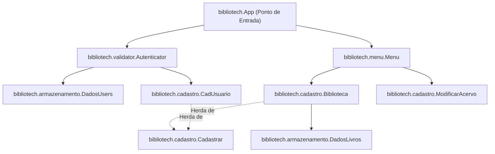
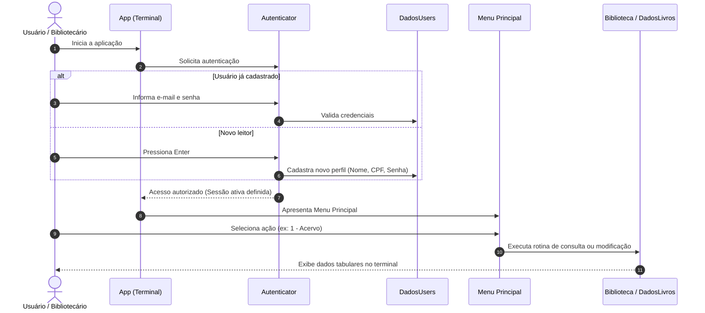

# BiblioTech - Sistema de Gestão e Digitalização de Bibliotecas


---

## 1. Visão Geral do Projeto

O **BiblioTech** é uma solução em Java desenvolvida para modernizar e digitalizar a operação rotineira de bibliotecas. Historicamente, a administração de bibliotecas físicas tem sido dependente de fichários de papel, cadernos manuais de registro ou planilhas descentralizadas, o que gera gargalos como perda de dados, inconsistência no controle de exemplares e lentidão no atendimento ao leitor.

O projeto propõe a automação completa dos pilares fundamentais de uma biblioteca:
- **Gestão de Acervo:** Catalogação padronizada, consulta multiatributo e controle dinâmico de estoque de obras.
- **Gestão de Usuários:** Cadastro estruturado de leitores e administradores com níveis de privilégio definidos.
- **Autenticação e Segurança:** Controle rigoroso de acesso via credenciais, com mecanismos de proteção contra tentativas indevidas e recuperação de senha.
- **Circulação de Exemplares:** Estruturação dos processos de empréstimo e devolução de volumes.

---

## 2. Arquitetura do Sistema

O projeto foi construído sobre os princípios da Programação Orientada a Objetos (POO), adotando abstração, polimorfismo, encapsulamento e separação de responsabilidades em pacotes dedicados.



### Estrutura de Diretórios e Pacotes

```
src/
└── bibliotech/
    ├── App.java                   # Inicializador do sistema e orquestrador principal
    ├── armazenamento/
    │   ├── DadosLivros.java       # Repositório em memória do acervo de obras
    │   └── DadosUsers.java        # Repositório em memória de credenciais e perfis
    ├── cadastro/
    │   ├── Cadastrar.java         # Classe abstrata base com contrato CRUD
    │   ├── CadUsuario.java        # Gerenciamento de ciclo de vida de usuários
    │   ├── Biblioteca.java        # Gerenciamento e manutenção do acervo bibliográfico
    │   └── ModificarAcervo.java   # Operações de circulação (empréstimo e devolução)
    ├── menu/
    │   └── Menu.java              # Interface textual e roteamento de comandos
    ├── validator/
    │   └── Autenticator.java      # Validação de credenciais e recuperação de acesso
    └── test/
        └── Teste.java             # Rotinas de validação lógica e prototipagem
```

---

## 3. Funcionalidades Detalhadas

### 3.1. Autenticação e Controle de Acesso (`Autenticator` & `DadosUsers`)
- **Login com Validação em Camadas:** Verificação de e-mail e chave de segurança cadastrados.
- **Prevenção de Ataques de Força Bruta:** Limite estrito de tentativas consecutivas para inserção da senha (até 3 tentativas).
- **Recuperação Segura de Credenciais:** Redefinição de senha vinculada à validação do CPF cadastrado do titular, garantindo a integridade dos dados da conta.
- **Onboarding Integrado:** Opção direta para novos leitores realizarem o cadastro pressionando a tecla `Enter` na tela de login.
- **Controle de Sessão Ativa:** Rastreamento do identificador único do usuário conectado para autorização de ações no sistema.
- **Níveis de Acesso Diferenciados:**
  - `ADM`: Acesso pleno às rotinas de gerenciamento de acervo, catálogo e administração.
  - `USER`: Acesso às rotinas de consulta, perfil e circulação de exemplares.

### 3.2. Gerenciamento de Usuários (`CadUsuario`)
- **Cadastro Completo de Leitores:** Coleta de nome completo, e-mail único, CPF e confirmação dupla de senha.
- **Validação de Unicidade:** Bloqueio de duplicidade de e-mail no ato do registro com convite para login.
- **Remoção de Perfil (Direito ao Esquecimento):** Exclusão assistida de conta do usuário com confirmação explícita de segurança (`[y]/[n]`).
- **Administrador Padrão (Seed):** Inicialização automática de um perfil de administrador do sistema (`root`) para manutenção imediata.

### 3.3. Gestão Digital de Acervo (`Biblioteca` & `DadosLivros`)
- **Catalogação Padronizada:** Inclusão detalhada de obras contendo:
  - Título da obra
  - Nome do Autor
  - Gênero literário baseado no Enum tipado `Genero` (`TECNOLOGIA`, `POESIA`, `ROMANCE`, `FILOSOFIA`, `HISTORIA`, `BIOGRAFIA`, `DRAMA`, `SUSPENSE`, `MANGA`)
  - Código identificador único (normalizado em caixa alta)
  - Ano de publicação
  - Quantidade física disponível em estoque
- **Tabela de Visualização do Acervo:** Exibição tabular estruturada com índice, título, autor, gênero, código, ano e quantidade.
- **Edição Granular de Obras:** Possibilidade de alteração individual dos dados de qualquer livro do acervo mediante inserção do código da obra (título, autor, gênero, ano ou quantidade).
- **Remoção Segura de Itens:** Exclusão de obras por código com prompt de dupla confirmação.
- **Motor de Busca Multi-Critério (`buscarLivro`):** Localização ágil por correspondência de autor, título, gênero, código ou ano, retornando a disponibilidade calculada em tempo real.
- **Status em Tempo Real:** Sinalização automática de estado da obra (`Disponível` ou `Indisponível`) conforme o saldo de exemplares.

### 3.4. Circulação e Operação de Balcão (`ModificarAcervo`)
- **Retirada de Livro (`pegarLivro`):** Registro de saída do exemplar vinculado ao usuário autenticado, com decremento de estoque.
- **Devolução de Livro (`devolverLivro`):** Registro de retorno do exemplar à estante, com incremento de estoque e liberação do status da obra.

### 3.5. Interface de Navegação CLI (`Menu`)
- Menu numérico intuitivo com tratamento de erros de digitação e repetição automática de opções inválidas:
  ```
  --------------- MENU ---------------
  [1] - Acervo
  [2] - Editar Livros
  [3] - Adicionar Livros
  [4] - Pegar Livro
  [5] - Devolver Livro
  ```

---

## 4. Modelagem de Dados

### Entidade Usuário (`DadosUsers`)
| Campo | Tipo | Descrição |
| :--- | :--- | :--- |
| `email` | `String` (Chave Primária) | E-mail corporativo ou pessoal do usuário |
| `nome` | `String` | Nome completo do leitor ou bibliotecário |
| `senha` | `String` | Chave de segurança para login |
| `cpf` | `String` | Documento de identificação único (somente dígitos) |
| `tipoUser` | `Enum (nivelAcesso)` | Privilégio de sistema (`ADM` ou `USER`) |

### Entidade Livro (`DadosLivros` / `Biblioteca`)
| Campo | Tipo | Descrição |
| :--- | :--- | :--- |
| `titulo` | `String` (Chave Primária) | Nome da obra literária |
| `autor` | `String` | Nome do autor ou organizador |
| `genero` | `Enum (Genero)` | Categoria literária padronizada |
| `codigo` | `String` | Código catalográfico único (ex: `TEC01`, `ROM02`) |
| `ano` | `String` | Ano de publicação ou edição |
| `quantidade` | `String` / `int` | Quantidade total de exemplares disponíveis |
| `status` | `Enum (statusLivro)` / `String` | Estado atual da obra (`Disponível`, `Indisponível`, `Emprestado`) |

---

## 5. Fluxo Operacional da Biblioteca



---

## 6. Tecnologias Utilizadas

- **Linguagem:** Java (OpenJDK 17+)
- **Estruturas de Armazenamento:** `java.util.HashMap`, `java.util.ArrayList`, `java.util.Spliterator`
- **Entrada e Saída:** `java.util.Scanner`, `System.out.printf`
- **Controle de Versão:** Git

---

## 7. Como Executar o Projeto

### Pré-requisitos
- Ter o **JDK 17** (ou superior) instalado e configurado nas variáveis de ambiente (`JAVA_HOME`).
- Git instalado na máquina.

### Passo a Passo via Terminal

1. **Clonar o repositório:**
   ```bash
   git clone https://github.com/roberivan7/bibliotech.git
   cd bibliotech
   ```

2. **Compilar os arquivos-fonte:**
   ```bash
   javac -d out/production/bibliotech src/bibliotech/*.java src/bibliotech/*/*.java
   ```

3. **Executar a aplicação:**
   ```bash
   java -cp out/production/bibliotech bibliotech.App
   ```

### Execução via IDE (IntelliJ IDEA / Eclipse / VS Code)
1. Abra a pasta raiz do projeto na sua IDE de preferência.
2. Certifique-se de que o diretório `src` esteja marcado como **Sources Root**.
3. Localize o arquivo `src/bibliotech/App.java`.
4. Execute o método `main()` diretamente pelo botão **Run**.

---

## 8. Credenciais Padrão do Sistema (Seed)

Para facilidade de testes e operação inicial, o sistema conta com uma credencial de Administrador pré-configurada:

| Identificador | Valor de Acesso |
| :--- | :--- |
| **E-mail** | `admin@bibliotech.com` |
| **Senha** | `@Admin321` |
| **Nível** | `ADM` |

---

## 9. Próximos Passos e Roadmap de Evolução

- [ ] **Persistência Externa:** Migração do armazenamento em memória (`HashMap`) para banco de dados relacional (PostgreSQL / MySQL) ou serialização em arquivos JSON/SQLite.
- [ ] **Finalização do Módulo de Circulação:** Conclusão da lógica de contagem e histórico em `ModificarAcervo.pegarLivro()` e `ModificarAcervo.devolverLivro()`.
- [ ] **Data e Prazos de Devolução:** Implementação de cálculo automático de data limite para devolução com alerta de atraso.
- [ ] **Interface Gráfica ou Web:** Evolução da interface de linha de comando para API REST ou aplicação desktop/web responsiva.

---

## 10. Licença

Este projeto é desenvolvido para fins acadêmicos e profissionais com o propósito de digitalização de processos bibliotecários. Distribuído sob a licença MIT.
